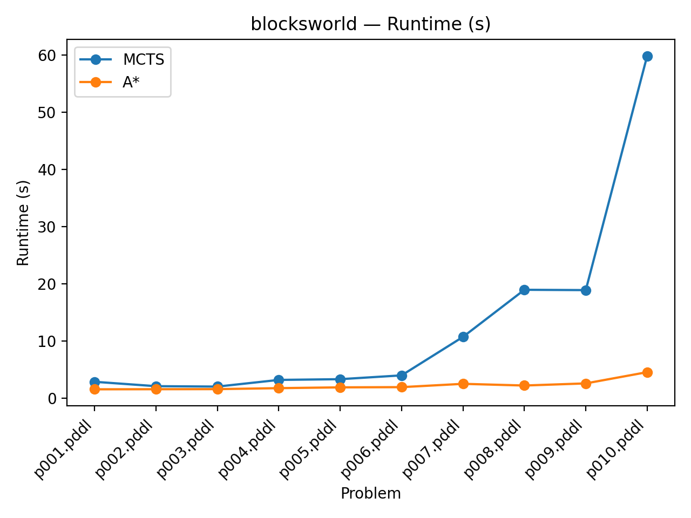
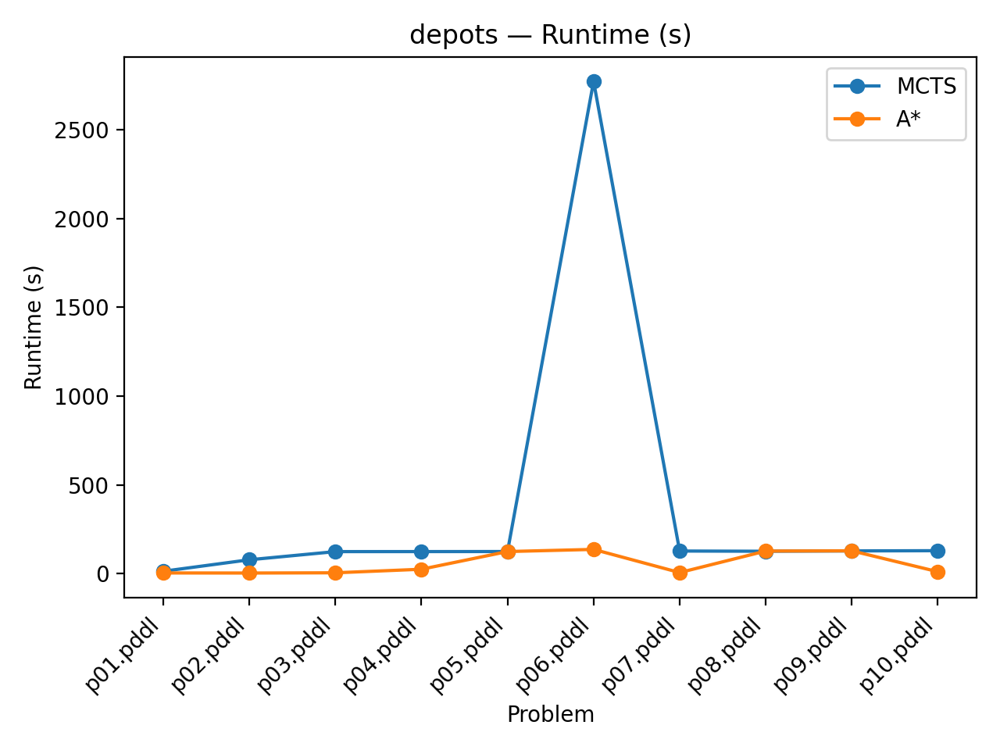
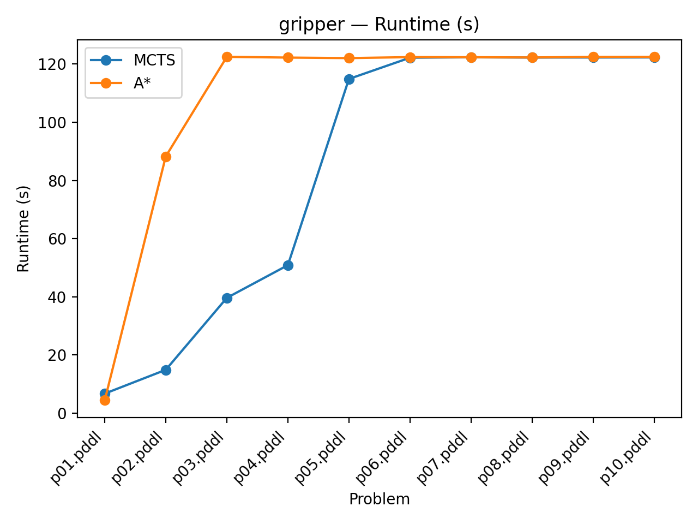
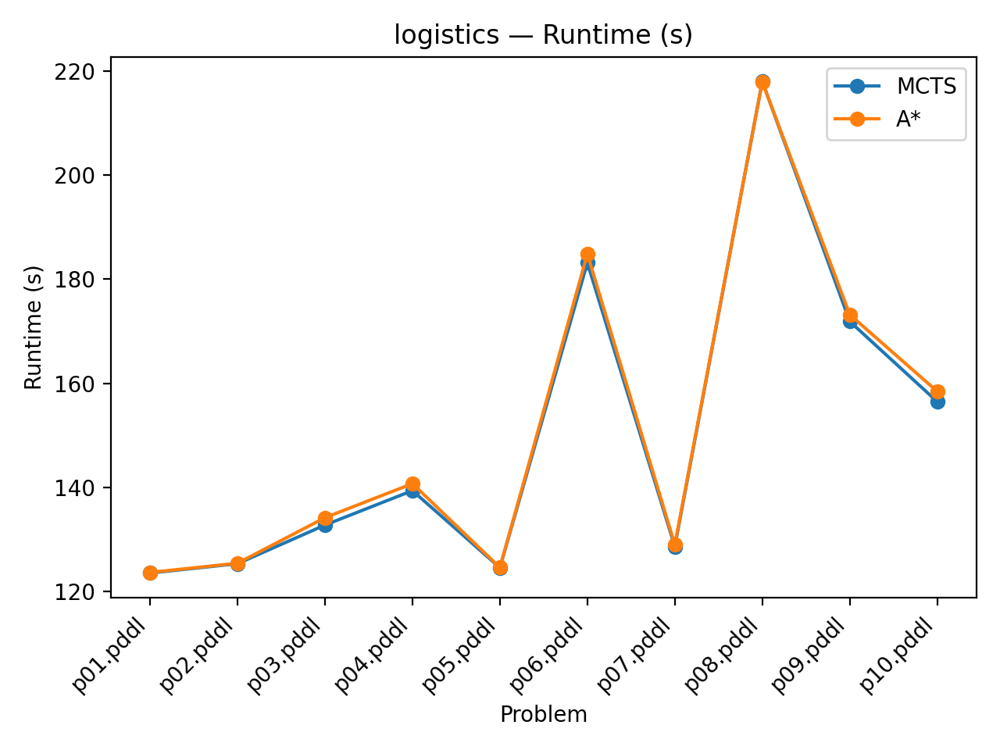
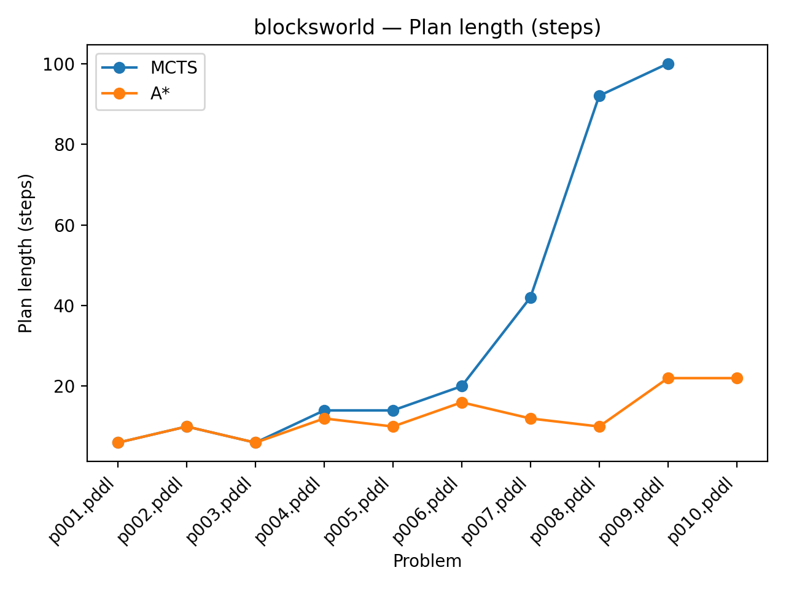
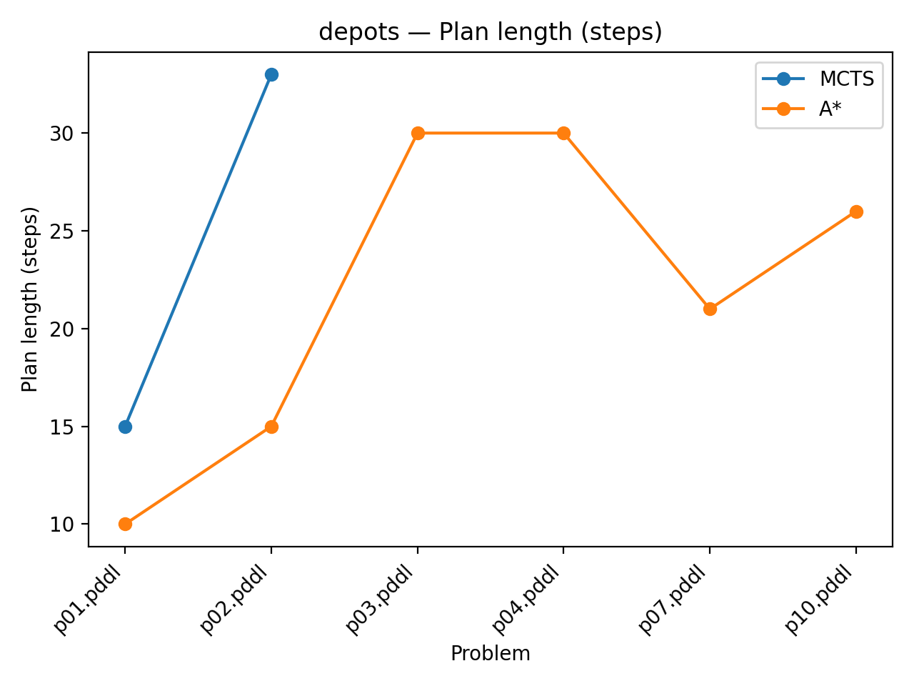
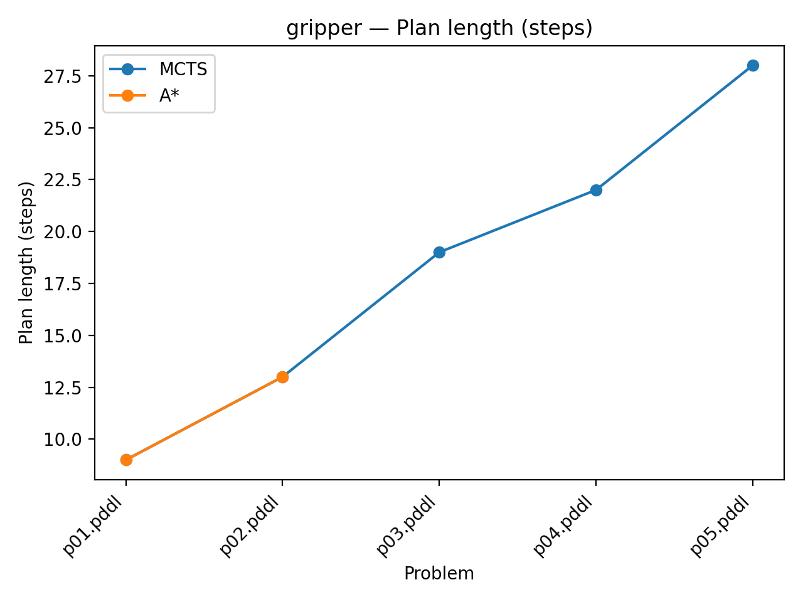
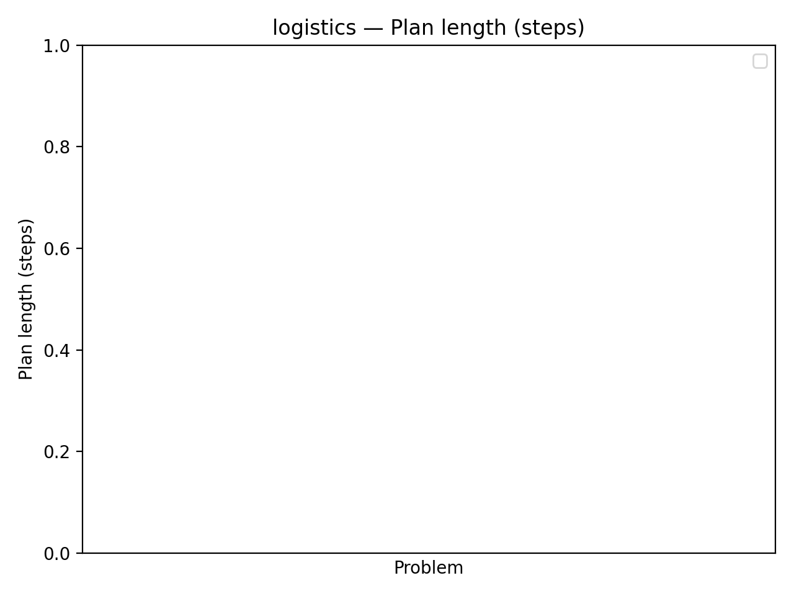

# Comparaison entre A* et MCTS pour la planification automatique

## Auteurs

- Kylian DESCHAMPS
- Kadir ERAMIL

## Exécution

- Lancer toutes les expériences et générer `results.csv` : `python3 run_experiments.py`
- Générer les figures à partir des résultats : `python3 make_plots.py`

## 1. Introduction

La planification automatique vise à générer une séquence d’actions permettant de transformer un état initial en un état but, à partir d’un modèle symbolique du domaine. Parmi les approches classiques, les méthodes de recherche heuristique telles que A* sont largement utilisées lorsqu’une heuristique informative est disponible. À l’inverse, les approches basées sur Monte-Carlo, comme Monte-Carlo Tree Search (MCTS), reposent sur l’exploration stochastique de l’espace des états et ne nécessitent pas nécessairement de fonction heuristique explicite.

L’objectif de ce travail est de comparer expérimentalement une approche de planification basée sur **A\*** et une approche **MCTS fondée sur des random walks**, sur plusieurs domaines de planification standard. Nous cherchons à analyser leurs performances respectives en termes de temps de calcul, de taux de succès et de qualité des plans générés.

---

## 2. Méthodologie

### 2.1 Implémentations

Deux planificateurs ont été implémentés en Java à l’aide de la bibliothèque **PDDL4J** :

- **A\*** : planificateur basé sur une recherche A* classique, utilisant l’heuristique *Fast Forward* fournie par PDDL4J.
- **MCTS** : planificateur de type Monte-Carlo basé sur des *random walks purs*. À chaque étape, les actions applicables sont évaluées par un nombre fixe de simulations aléatoires, et l’action ayant la meilleure estimation est sélectionnée.

L’implémentation MCTS ne repose sur aucune heuristique guidée (ni UCT), conformément aux consignes du sujet.

### 2.2 Domaines et instances

Les expériences ont été réalisées sur quatre domaines standards issus des compétitions IPC :

- Blocksworld  
- Depots  
- Gripper  
- Logistics  

Pour chaque domaine, **10 instances de problèmes** (`p01` à `p10`) ont été sélectionnées.  
Chaque exécution dispose d’un **timeout de 300 secondes**.

Remarque : le champ *temps d’exécution* mesuré inclut le temps « mur » de l’exécution. Il peut donc légèrement dépasser 300s (arrêt effectif après détection du timeout côté planificateur).

### 2.3 Métriques évaluées

Les planificateurs sont comparés selon les critères suivants :

- **Taux de succès** : proportion d’instances résolues dans le temps imparti.
- **Temps d’exécution** : durée totale de résolution.
- **Longueur du plan** : nombre d’actions du plan séquentiel retourné (makespan).

---

## 3. Résultats expérimentaux

### 3.1 Temps d’exécution

Sur le domaine Blocksworld, A* présente un temps d’exécution très faible et stable, tandis que MCTS nécessite un temps de calcul plus important, lié à l’exploration aléatoire répétée de l’espace des états.

---

Dans le domaine Depots, A* reste globalement plus rapide que MCTS, bien que les deux approches se rapprochent du timeout sur certaines instances plus complexes.

---

Pour le domaine Gripper, **MCTS résout davantage d’instances que A\*** (dans nos runs), tandis que A\* atteint fréquemment le timeout. Les temps observés reflètent cette différence de taux de succès.

---

Dans le domaine Logistics, aucun planificateur ne parvient à résoudre les instances dans le temps imparti. Les temps observés correspondent majoritairement à l’atteinte du timeout.

---

### 3.2 Longueur des plans

Les plans produits par A* dans Blocksworld sont plus courts que ceux générés par MCTS, ce qui s’explique par l’efficacité de l’heuristique dans ce domaine fortement structuré.

---

Dans le domaine Depots, MCTS a un taux de succès nettement inférieur à A\*. Sur les rares instances où MCTS réussit (et où A\* réussit aussi), les plans générés par MCTS sont plus longs dans nos résultats.

---

Pour Gripper, les deux méthodes produisent des plans de longueur comparable. Sur les instances résolues par les deux, les longueurs observées sont identiques dans nos résultats.

---

Aucune longueur de plan n’est rapportée pour Logistics, aucun planificateur n’ayant trouvé de solution dans le temps imparti.

---

## 4. Discussion

Les résultats expérimentaux mettent en évidence des comportements contrastés entre les deux approches.

L’algorithme **A\*** se montre particulièrement efficace sur les domaines où l’heuristique est informative, comme Blocksworld. Il offre des temps d’exécution faibles, un taux de succès élevé et des plans de bonne qualité. Cependant, ses performances se dégradent fortement lorsque l’heuristique devient moins pertinente, comme dans Logistics.

À l’inverse, **MCTS** présente une plus grande robustesse dans certains domaines complexes ou mal guidés heuristiquement, comme Gripper, où il obtient un taux de succès légèrement supérieur à A*. Toutefois, l’absence de politique de sélection avancée (comme UCT) et d’heuristique intégrée limite fortement son efficacité globale, tant en termes de temps que de taux de réussite.

Ces résultats soulignent que les approches Monte-Carlo nécessitent des mécanismes de guidage plus sophistiqués pour rivaliser avec les méthodes de recherche heuristique classiques.

---

## 5. Conclusion

Dans ce travail, nous avons comparé une approche de planification basée sur A* et une approche MCTS fondée sur des random walks, sur quatre domaines standards de planification automatique.

Les expériences montrent que :

- **A\*** demeure la méthode la plus performante lorsque l’heuristique est adaptée au domaine.
- **MCTS**, dans sa version simple, peut occasionnellement produire des plans compétitifs, mais souffre d’un faible taux de succès et de coûts computationnels élevés.

Une perspective naturelle serait d’améliorer l’approche MCTS en intégrant des politiques de sélection de type UCT ou des heuristiques hybrides afin de guider plus efficacement l’exploration de l’espace des états.
